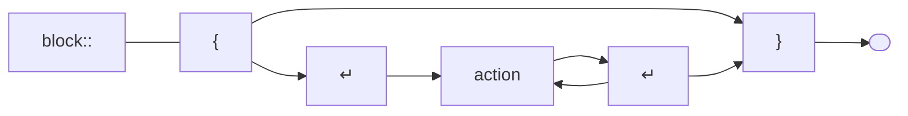
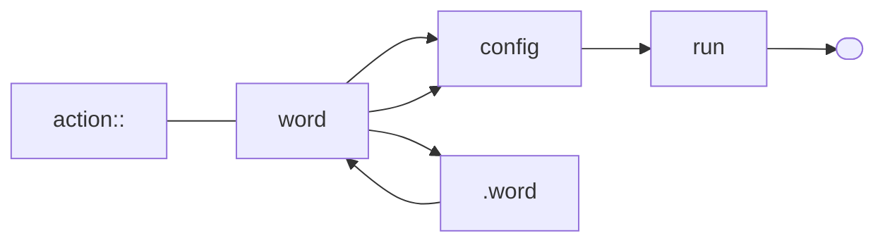
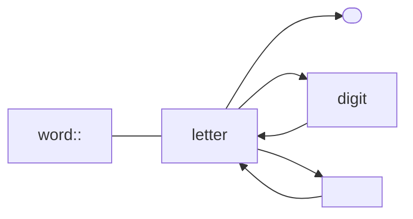
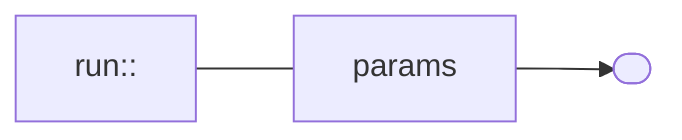
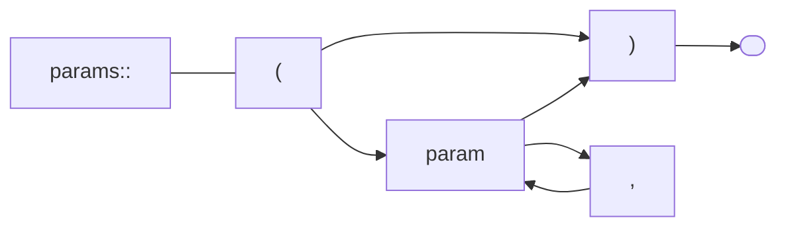
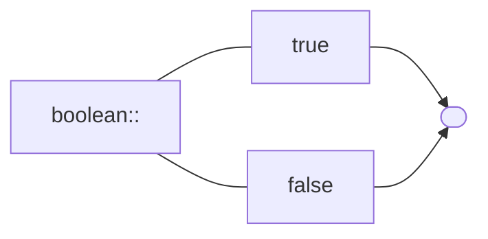

# quandoscript
Script engine for Quando

- Script format mostly follows https://en.wikipedia.org/wiki/Wirth_syntax_notation
  - `{a}` is any, i.e. 0+
  - `+a+` is many, i.e. 1+
  - `[a]` is optional, i.e. 0 or 1
  - `(a|b)` are groups; without () at top level
  - `(")` is double quote character
  - `"+"` is (punctuation) character

Here is the (growing) script definition :
- line = {action}
- action = word {. word} _[params]_ +whitespace+
- params = "(" param {, param} ")"
- param = word "=" value
- word = letter {letter|digit}
- value = number | range | boolean | string
- string = (") {character} (")
- boolean = true | false
- letter = a..z | A..Z
- digit = 0..9
- character = UNICODE | prefix_character
- prefix_character = "\\" (") | "\\" "\\"

Notes:

- _* is 0..many, + is 1..many_

