# quandoscript
Script engine for Quando

Here is the (growing) script definition, note :

- xxx:: is the definition

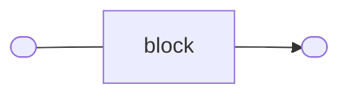
```mermaid
graph LR
    stop([ ])
    start([ ])---block--> stop
```

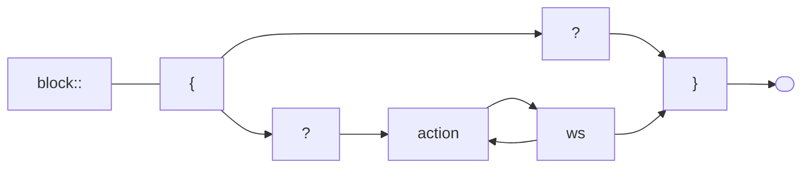
```mermaid
graph LR
    stop([ ])
    l-->?-->r
    block::---l["{"]-->lq[?]-->action-->ws-->r["}"]--> stop
    ws-->action
```

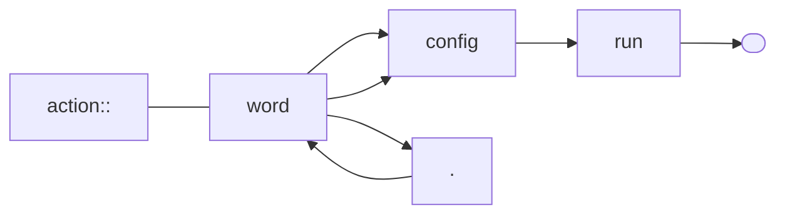
```mermaid
graph LR
    stop([ ])
    word --> config
    action::--- word-->config --> run --> stop
    word-->dot["."]-->word
```

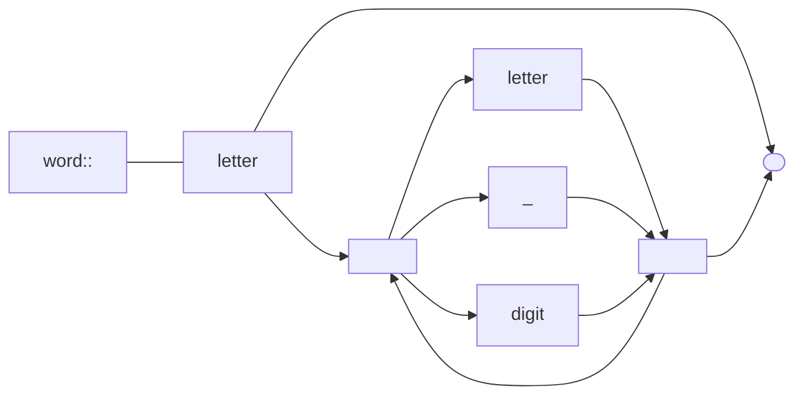
```mermaid
graph LR
    stop([ ])
    word:: --- letter-->stop
    letter-->l[ ]-->rl["letter"]-->r[ ]-->stop
    r-->l
    l-->u["_"]-->r
    l-->digit-->r
```

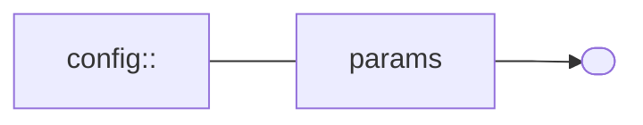
```mermaid
graph LR
    stop([ ])
    config::---params-->stop
```

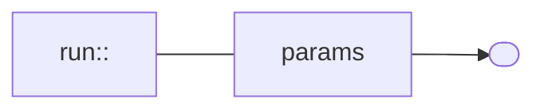
```mermaid
graph LR
    stop([ ])
    run::---params-->stop
```

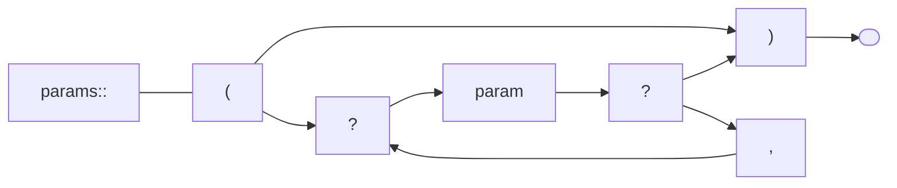
```mermaid
graph LR
    stop([ ])
    l --> r
    params:: --- l["("]-->?--> param-->rq[?]-->r[")"]-->stop
    rq-->c[","]-->?
```

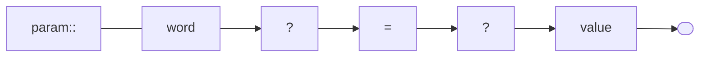
```mermaid
graph LR
    stop([ ])
    param:: --- word --> ? --> eq["="]-->rq[?]-->value-->stop
```

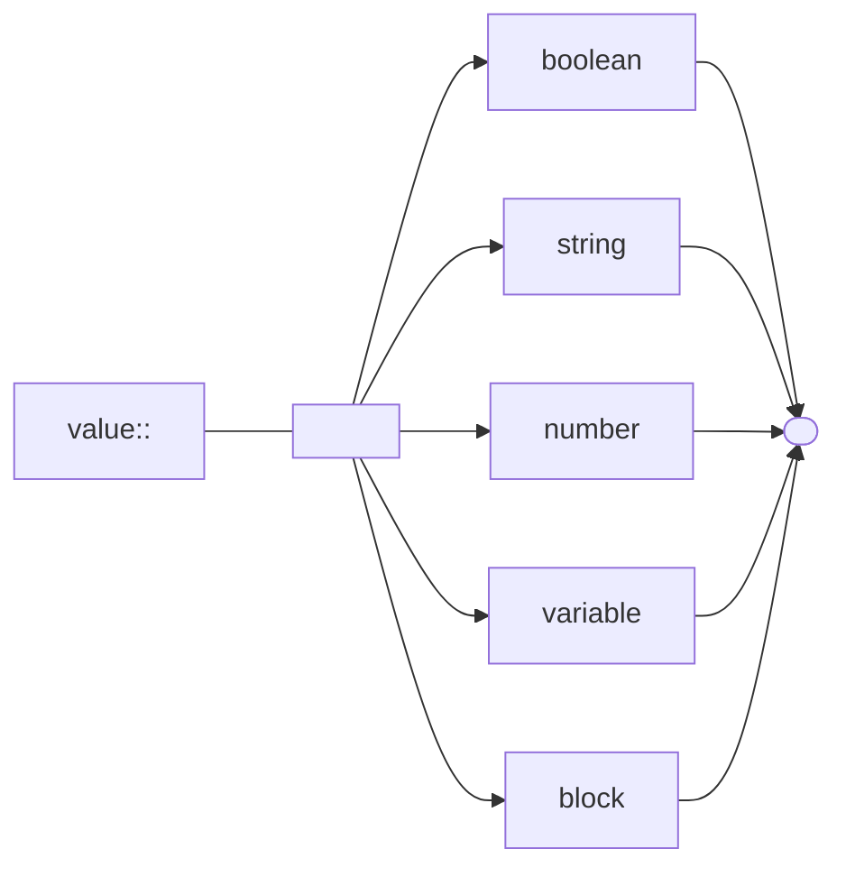
```mermaid
graph LR
    stop([ ])
    value:: --- l[ ]
    l--> boolean -->stop
    l--> string -->stop
    l--> number -->stop
    l--> variable -->stop
    l--> block -->stop
```

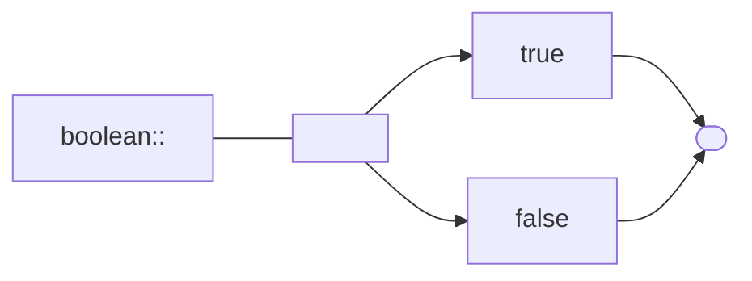
```mermaid
graph LR
    stop([ ])
    boolean::---l[ ]--> true --> stop
    l-->false --> stop
```

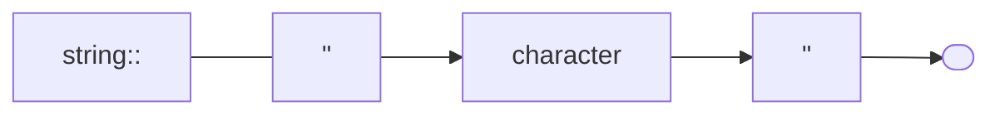
```mermaid
graph LR
    stop([ ])
    string::--- l[#quot;] -->character --> r[#quot;]--> stop
```

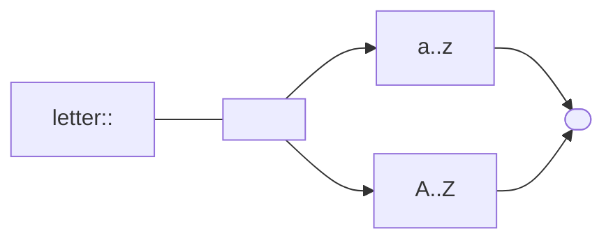
```mermaid
graph LR
    stop([ ])
    letter::---l[ ]--> a..z--> stop
    l--> A..Z--> stop
```

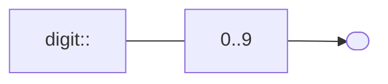
```mermaid
graph LR
    stop([ ])
    digit::--- 0..9--> stop
```

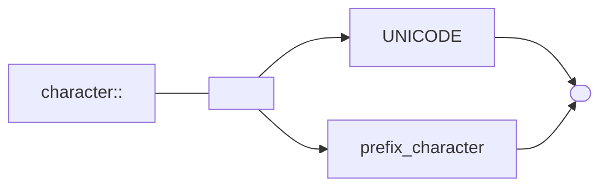
```mermaid
graph LR
    stop([ ])
    character::---l[ ]--> UNICODE--> stop
    l-->prefix_character --> stop
```

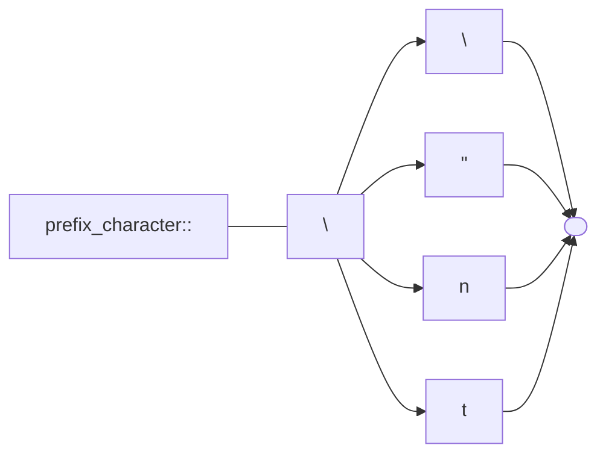
```mermaid
graph LR
    stop([ ])
    prefix_character::--- l["\"]-->slash["\"]--> stop
    l-->q[#quot;]-->stop
    l-->n-->stop
    l-->t-->stop
```

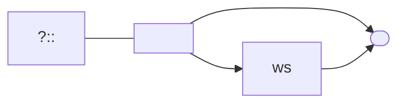
```mermaid
graph LR
    stop([ ])
    ?:: ---l[ ]--> stop
    l-->ws-->stop
```

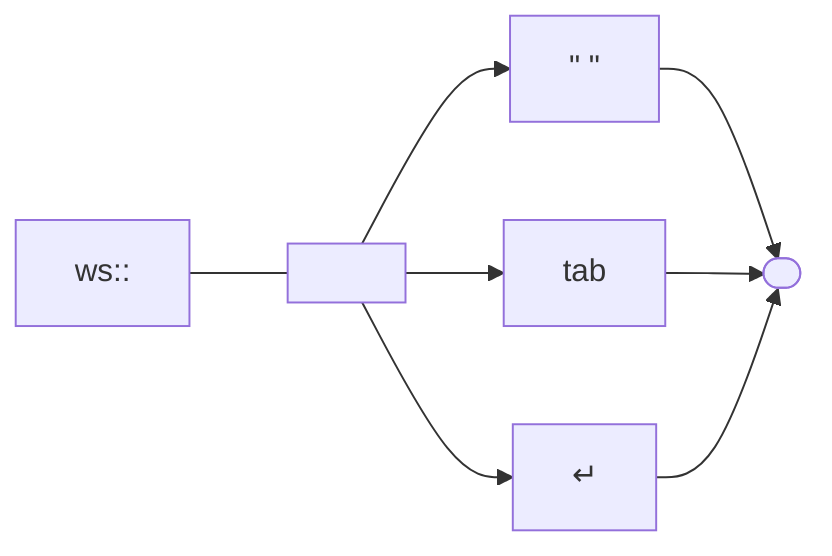
```mermaid
graph LR
    stop([ ])
    ws::---l[ ]-->s["#quot; #quot;"]-->stop
    l-->tab-->stop
    l-->nl["↵"]-->stop
```

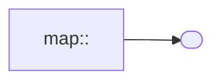
```mermaid
graph LR
    stop([ ])
    map:: --> stop
```
